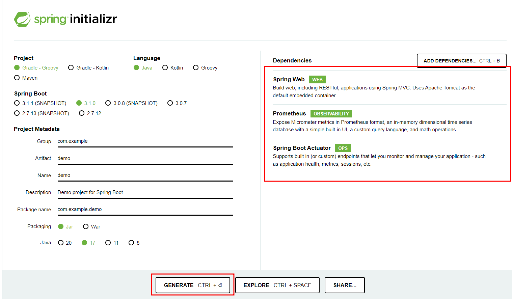
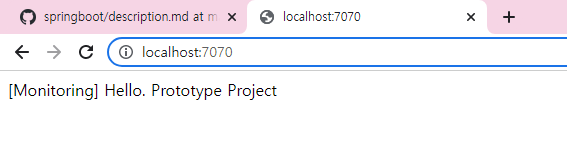
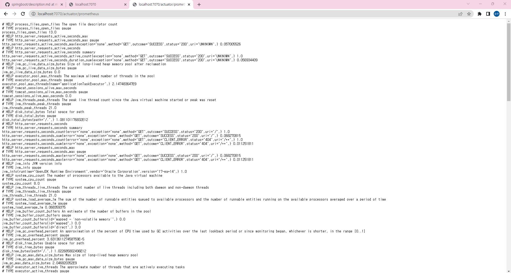

# Spring Boot + Prometheus Monitoring

### 1. Frame만들기
* [start.spring.io](start.sping.io) 에서 진행  
  
### 2. 필요한 의존성 추가하기
* Spring Web, Prometheus, Spring Boot Actuator


### 3. MainConroller.java  
* ./src/main/java/com/monitoring/prometheus/conroller/MainController.java
```
package com.monitoring.prometheus.controller;
import org.springframework.boot.autoconfigure.EnableAutoConfiguration;
import org.springframework.stereotype.Controller;
import org.springframework.web.bind.annotation.RequestMapping;
import org.springframework.web.bind.annotation.ResponseBody;

@Controller
@EnableAutoConfiguration

public class MainController {
	@RequestMapping (value="/")
		@ResponseBody
		public String domain() {
			return "[Monitoring] Hello. Prototype Project";
		}

		@RequestMapping ("/endpoint1")
		@ResponseBody
		public String doEndPoint1() {
			return "[Monitoring] EndPoint 1";
		}

		@RequestMapping ("/endpoint2")
		@ResponseBody
		public String doEndPoint2() {
			return "[Monitoring] EndPoint 2";
		}
}
```  
### 4. ./src/main/resources/application.yml
* 코드수정  
```
spring:
  application:
    name: monitoring

management:
  endpoint:
    metrics:
      enabled: true
    prometheus:
      enabled: true
  
  endpoints:
    web:
      exposure:
        include: health, info, metrics, prometheus
    
    metrics:
      tags:
        application: ${spring.application.name}
```

### 5. 실행
```
./gradlew
```

### 6. 결과
- Test시 포트포워딩을 통해 7070으로 진행했습니다.  
Default Port는 8080 이오니 참고바랍니다.  

- 접속화면  
[http://localhost:8080/](http://localhost:8080)

- Metric 화면  
[http://localhost:8080/actuator/prometheus](http://localhost:8080/actuator/prometheus)



### Reference
[https://blog.bespinglobal.com/post/springboot-prometheus-grafana%EC%9D%84-%EC%9D%B4%EC%9A%A9%ED%95%9C-monitoring-%EA%B5%AC%EC%B6%95/](https://blog.bespinglobal.com/post/springboot-prometheus-grafana%EC%9D%84-%EC%9D%B4%EC%9A%A9%ED%95%9C-monitoring-%EA%B5%AC%EC%B6%95/)