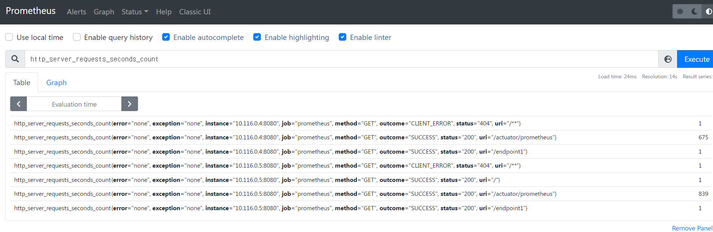

# Spring Boot + Prometheus Monitoring

### 1. Frame만들기
* [start.spring.io](start.sping.io) 에서 진행  
  
### 2. 필요한 의존성 추가하기
* Spring Web, Prometheus, Spring Boot Actuator


### 3. MainConroller.java  
* ./src/main/java/com/monitoring/prometheus/conroller/MainController.java
```
package com.monitoring.prometheus.controller;
import org.springframework.boot.autoconfigure.EnableAutoConfiguration;
import org.springframework.stereotype.Controller;
import org.springframework.web.bind.annotation.RequestMapping;
import org.springframework.web.bind.annotation.ResponseBody;

@Controller
@EnableAutoConfiguration

public class MainController {
	@RequestMapping (value="/")
		@ResponseBody
		public String domain() {
			return "[Monitoring] Hello. Prototype Project";
		}

		@RequestMapping ("/endpoint1")
		@ResponseBody
		public String doEndPoint1() {
			return "[Monitoring] EndPoint 1";
		}

		@RequestMapping ("/endpoint2")
		@ResponseBody
		public String doEndPoint2() {
			return "[Monitoring] EndPoint 2";
		}
}
```  
### 4. ./src/main/resources/application.yml
* 코드수정  
```
spring:
  application:
    name: monitoring

management:
  endpoint:
    metrics:
      enabled: true
    prometheus:
      enabled: true
  
  endpoints:
    web:
      exposure:
        include: health, info, metrics, prometheus
    
    metrics:
      tags:
        application: ${spring.application.name}
```

### 5. 실행
```
./gradlew build
java -jar ./build/libs/{name}.jar
```
  


### 6. 결과
- Test시 포트포워딩을 통해 7070으로 진행했습니다.  
Default Port는 8080 이오니 참고바랍니다.  

- 접속화면  
[http://localhost:8080/](http://localhost:8080)

- Metric 화면  
[http://localhost:8080/actuator/prometheus](http://localhost:8080/actuator/prometheus)


### 부록1 : Dockerfile Build 하기  
- Dockerfile 파일생성
```
# Base image
FROM openjdk:17-alpine

# Working directory
WORKDIR /app

# Copy the compiled Java application JAR file
COPY ./prometheus/build/libs/webapp-for-prometheus-0.0.1-SNAPSHOT.jar /app/my-application.jar

# Expose the port
EXPOSE 8080

# Command to run the Java application
CMD ["java", "-jar", "my-application.jar"]
```

- Docker Image 만들기  
```
docker build -t {repo}/{app}:{ver}
```


### 부록2 : Prometheus설치
- ./prometheus_yaml 실행  

- 01-proemetheus-SA.yaml  
: Prometheus 동작에 필요한 SA 생성  

- 02-prometheus-clusterrole.yaml  
: Cluster 단위의 Role 생성  
: Cluster 단위인 이유는 동일한 App이 여러개 올라갈 시 Target을 쉽게 설정하기 위한 설정이다.  

- 03-prometheus-clusterrolebinding.yaml  
: SA에 Cluster Role 연결  

- 04-prometheus-config.yaml  
: Prometheus 설정파일

- 05-prometheus-deploy.yaml  
: Prometheus 배포  

- 결과  
Application에 대한 Metric을 확인 할 수 있었음



### Reference
[https://blog.bespinglobal.com/post/springboot-prometheus-grafana%EC%9D%84-%EC%9D%B4%EC%9A%A9%ED%95%9C-monitoring-%EA%B5%AC%EC%B6%95/](https://blog.bespinglobal.com/post/springboot-prometheus-grafana%EC%9D%84-%EC%9D%B4%EC%9A%A9%ED%95%9C-monitoring-%EA%B5%AC%EC%B6%95/)